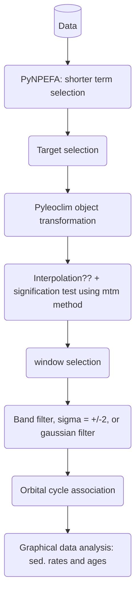

# Calculadoras Pr4
Repositório com as calculadoras em desenvolvimento. 
Os arquivos contidos na pasta programs tratam o dado LAS para servirem de entrada para o AchillesBR.
Até o presente momento existem 3 calculadoras que produzem 3 saídas (entradas do achillesBR) a saber: o
*dasfa.py*, que calcula a densidade aparente seca e a fração areia, o *pynpefa.py* que retorna a análise
de ciclicidade baseada em [daely](https://github.com/daeIy/PyNPEFA), e o *srate_method1.py* que implementa uma
das metodologias discutidas para o cálculo da taxa de sedimentação. Este último já incorpora o termo resultante 
da análise INPEFA mais apropriado para o cálculo da taxa de sedimentação via ciclos de 408k anos.

## Conteúdo do repositório
* programs: contém os programas principais
* inputs: arquivos de entrada e teste
* outputs: resultado do processamento
* modules: modelagem INPEFA

## Criação e migração para um novo ambiente de trabalho:

> conda create -n calculadoras python=3 

> conda activate calculadoras

## Dependências
* [Anaconda](https://www.anaconda.com/) >= 3
* cvxopt >= 1.2.0
* scipy >= 1.4.0
* spectrum >= 0.7.3
* lasio >= 0.24.0
* Cartopy = 0.21
* Xarray
* Dask
* NetCDF4
* Bottleneck
* Climlab

### Como instalar as dependências

Execute o shellcript com o seguinte comando abaixo:

> ./bibliotecas.sh

## Método experimental número 1:

## Como Executar o programa dasfa.py
* Abra o terminal (Linux) ou o powershell do anaconda (windows)
* Clone o repositório calculadoras ou faça o download se preferir
* Entre na pasta programs
* Digite o comando a seguir 
> python dasfa.py 
* Durante a execução digite as informações do nome do poço de teste
* Veja o print na tela com a porcentagem de valores nulos e decida com um sim ou não se deseja fazer a limpeza
* Decida digitando com um sim ou não se deseja selecionar um horizonte específico.
* Digite o nome do arquivo de saída da densidade aparente seca
* Digite o nome do arquivo de saída da fração areia.
 
## Como Executar o programa pynpefa.py
* Abra o terminal (Linux) ou o powershell do anaconda (windows)
* Clone o repositório calculadoras ou faça o download se preferir
* Entre na pasta programs
* Digite o comando a seguir 
> python pynpefa.py 
* Durante a execução digite as informações do nome do poço de teste
* Decida digitando com um sim ou não se deseja selecionar um horizonte específico.
* Digite o nome do arquivo de saída da análise INPEFA.

## Como Executar o programa srate_method1.py (experimental!)
* Abra o terminal (Linux) ou o powershell do anaconda (windows)
* Clone o repositório calculadoras ou faça o download se preferir
* Entre na pasta programs
* Digite o comando a seguir 
> python srate_method1.py 
* Durante a execução digite as informações do nome do poço de teste
* Decida digitando com um sim ou não se deseja selecionar um horizonte específico.
* Aguarde até a finalização completa. 
